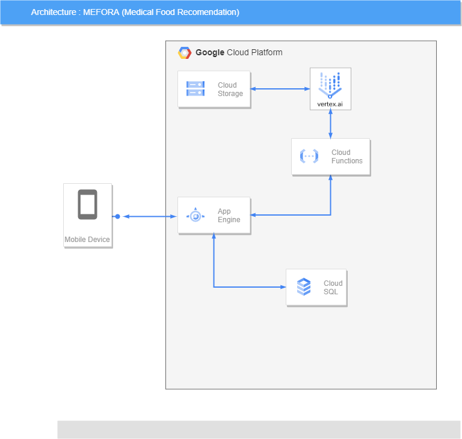

# Mefora-CC

Mefora is an app that helps people with diseases who have difficulty in choosing their food menu won't have that kind of difficulty again by proposing an application that will receive input disease data from the user, then the user can find out what foods are allowed to be eaten.

> Base url of this service is: http://localhost:8080/

The service available:

- Users
  <pre>GET  /api/users</pre>
  <pre>GET  /api/users/uid</pre>
  <pre>POST /api/users</pre>
  <pre>PUT  /api/users/uid</pre>
  <pre>DEL  /api/users/uid</pre>

- Lists
  <pre>POST /api/lists</pre>
  <pre>GET /api/lists/doctor_uid</pre>
  <pre>GET /api/lists/patient_uid</pre>

- diseases
  <pre>POST /api/diseases</pre>
  <pre>GET  /api/diseases</pre>
  <pre>GET  /api/diseases/name</pre>

- userDiseases
  <pre>POST /api/userDiseases</pre>
  <pre>GET  /api/userDiseases</pre>

## Architecture
.
